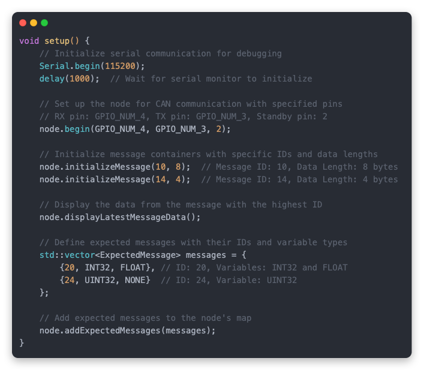

# In the vehicle

## Node

The sensors are configured as nodes on the CAN bus, meaning they each are paired with a small computer board. The latter acts as the middleman between the sensor’s interfacing protocol (i.e. the language the sensor talks in) and the CAN bus (i.e. what the telemetry system talks in).

The node computer hardware diagram is presented in the figure below.

<figure><picture><source srcset=".gitbook/assets/node dark 1@4x.png" media="(prefers-color-scheme: dark)"></picture><figcaption></figcaption></figure>

<figure><picture><source srcset=".gitbook/assets/node dark 2@4x.png" media="(prefers-color-scheme: dark)"></picture><figcaption><p>Technical diagrams of the node computer</p></figcaption></figure>

### Technical specs



* The nodes use a ESP32 microcontroller (S3 or C3 models) from Espressif, manufactured by Seeed ([XIAO ESP32C3](https://wiki.seeedstudio.com/XIAO\_ESP32C3\_Getting\_Started/) / [XIAO ESP32S3](https://wiki.seeedstudio.com/xiao\_esp32s3\_getting\_started/)) (top surface).
* It uses two rows of 6 and 5 female headers (top surface) to connect to the sensor shield.
* They are equipped with [TCAN1462V-Q1](https://www.ti.com/lit/ds/symlink/tcan1462-q1.pdf?HQS=dis-mous-null-mousermode-dsf-pf-null-wwe\&ts=1698833597358) CAN transceivers (bottom surface) that make use of the MCU’s native [TWAI](https://docs.espressif.com/projects/esp-idf/en/stable/esp32/api-reference/peripherals/twai.html#overview) controllers.
* They have two daisy-chained 4-pin JST XH connectors (top surface) for the data transmission CAN High / Low, and the power pins from the Receiver +5V and GND.
* The slide switch on the top surface is the CAN termination switch, connecting the CAN High and Low lines by a 120 Ohm resistor.
* The CAN lines also have footprint for capacitors in series and parallel (bottom surface) to help if filtering is needed on the bus.



<figure><figcaption></figcaption></figure>


This pinout diagram is valid for the XIAO ESP32-C3 microcontrollers, but some pins also double as analog pins on the XIAO ESP32-S3 (see Table 1), marked as A\<Number> (e.g. A5).


<table><thead><tr><th width="154">pin #</th><th>C3 pinout</th><th>S3 pinout</th></tr></thead><tbody><tr><td>1</td><td>5V</td><td>5V</td></tr><tr><td>2</td><td>GND</td><td>GND</td></tr><tr><td>3</td><td>3.3V</td><td>3.3V</td></tr><tr><td>4</td><td>D7 / RX / GPIO20</td><td>D7 / RX / GPIO44</td></tr><tr><td>5</td><td>D8 / SCK / GPIO8</td><td>D8 / A8 / SCK / GPIO7</td></tr><tr><td>6</td><td>D9 / MISO / GPIO9</td><td>D9 / A9 / MISO / GPIO8</td></tr><tr><td>7</td><td>D6 / TX / GPIO21</td><td>D6 / TX / GPIO43</td></tr><tr><td>8</td><td>D5 / SCL / GPIO7</td><td>D5 / A5 / SCL / GPIO6</td></tr><tr><td>9</td><td>D4 / SDA / GPIO6</td><td>D4 / A4 / SDA / GPIO5</td></tr><tr><td>10</td><td>D3 / A3 / GPIO5</td><td>D3 / A3 / GPIO4</td></tr><tr><td>11</td><td>D10 / MOSI / GPIO10</td><td>D10 / A10 / MOSI / GPIO9</td></tr><tr><td>CAN_TX</td><td>GPIO_NUM_3</td><td>GPIO_NUM_2</td></tr><tr><td>CAN_RX</td><td>GPIO_NUM_4</td><td>GPIO_NUM_3</td></tr><tr><td>CAN_Standby</td><td>GPIO2</td><td>GPIO1</td></tr></tbody></table>



### Setup

#### Hardware

1. Assembling the node case (in ascending order)

<figure><figcaption></figcaption></figure>

2. Attaching the node to the CAN/Power bus

Connecting to the CAN and Power bus is easy. There are two 4-pin JST XH connectors opposite to the USB-C connector, which are connected in parallel for you to daisy-chain the whole system. This means that there’s no wrong way to connect it, just attach one cable to the bus, and if you want to add a new sensor, just attach another cable in the other connector and into the new node.

<figure><picture><source srcset=".gitbook/assets/can assembly dark@4x.png" media="(prefers-color-scheme: dark)"></picture><figcaption></figcaption></figure>

3. Installing in the vehicle

Place the node wherever it is needed in the vehicle.

<figure><figcaption></figcaption></figure>


If you need to make a new cable, make sure to use the proper connections as seen in the figure below.


<figure><picture><source srcset=".gitbook/assets/cable wiring dark@4x.png" media="(prefers-color-scheme: dark)"></picture><figcaption><p>CAN &#x26; Power cable wiring diagram</p></figcaption></figure>


#### Software

1. Installing the integrated development environment (IDE)

The system works similar to most Arduino projects, as it has been coded in C++ using the Arduino IDE.

Any IDE will do the job, however we recommend using the following:

[Arduino IDE](https://www.arduino.cc/en/software) <mark style="color:orange;">is the easiest to use, has plenty of documentation and forum help and is sufficient almost 99% of the time.</mark>

[Platform IO](https://platformio.org/) (through VSCode) is essentially a pro version, where you have more control but requires a manual setup.

[ESP-IDF](https://docs.espressif.com/projects/esp-idf/en/stable/esp32/get-started/index.html#introduction) is the MCU's native IDE, which gives more liberty in using all its functions.

2. ESP board definitions

The ESP boards (MCU) are not defined by default in the Arduino IDE. You will have to add them initially to be able to connect to the nodes and others.

To do this in the Arduino IDE, navigate to **File > Preferences**, and fill **"Additional Boards Manager URLs"** with the url below: [_https://raw.githubusercontent.com/espressif/arduino-esp32/gh-pages/package\_esp32\_index.json_](https://raw.githubusercontent.com/espressif/arduino-esp32/gh-pages/package\_esp32\_index.json)

Navigate to **Tools > Board > Boards Manager...**, type the keyword "**esp32**" in the search box, select the latest version of **esp32**, and install it.

3. Installing the node library

Download the two files `Node.h` and `Node.cpp` from the [Github repository](https://github.com/augustjaubert/UCL-SEM-Telemetry-System) in the Node folder.

To add the node library to your arduino sketch[^1], simply add the two files in your sketch folder.

<details>

<summary>Example folder organisation</summary>

```
example_sketch (folder)
-> Node.cpp
-> Node.h
-> example_sketch.ino (arduino sketch)
```

</details>

4. Connecting to the node computer board

To connect the node computer to the arduino sketch, select the top-left text box **Select Board**.

<figure><figcaption></figcaption></figure>

For C3 models - XIAO\_ESP32C3

For S3 models - XIAO\_ESP32S3

### How to use

Find the quick guide in the [overview section](./#quick-installation-guide).


You can add up to 70+ nodes onto the CAN bus, however limiting the number of sensors to <15 is recommended (i.e. limit the different messages competing on the CAN bus).


#### Steps

1. <mark style="color:orange;">Switch the node ON</mark>.

<figure><figcaption></figcaption></figure>

2. <mark style="color:orange;">Assemble the node</mark> (sensor, computer and case).
3. <mark style="color:orange;">Connect a CAN cable</mark> to one of the JST sockets to add the node on the CAN bus.
4. If the node is added at the end of the bus, <mark style="color:orange;">switch the CAN termination ON.</mark>


After the system is powered, <mark style="color:orange;">the node is powered</mark> <mark style="color:orange;">if you see a LED lighting up.</mark>



Later versions of the node computer boards have a <mark style="color:orange;">slide switch on the bottom</mark>, which need to be activated for the power rail to go through the board.&#x20;

Be careful because earlier versions have reversed ON/OFF writings by mistake, so if in doubt test it outside the vehicle, and if you see a blinking red/yellow light coming from the node, it is powered.


#### Troubleshooting

If it seems as though the Receiver is not seeing the sensor messages, or something else is not working as it should:

1. Disassemble the node.
2. Connect the node computer to your laptop through USB.
3. Open Arduino IDE, and check that you have the correct board definition in the top-left text box **Select Board**.

<figure><figcaption></figcaption></figure>

<details>

<summary>No board appearing</summary>

If you don't see a board appearing, then the MCU is not powered, or the serial connection has been severed. This can be because,

* The USB cable is not properly connected either to the node or laptop
* The MCU is not receiving power, which can be checked with a multimeter on the MCU pins to see if it detects a voltage. This can be due to a severed power connection on the circuit.
* The serial connection is severed, which can be because&#x20;
  * the USB connector on the MCU has been damaged,&#x20;
  * or because something (e.g. static electricity) has caused your laptop to disconnect the USB port (safety mode). It happens that connection is re-established after some time.
    * You can first try to reset the board by clicking the **RESET BUTTON** once while the board is connected to your PC. If that does not work, hold the **BOOT BUTTON**, connect the board to your PC while holding the **BOOT** button, and then release it to enter **bootloader mode**.

</details>

<details>

<summary>The wrong board is appearing</summary>

If the wrong board is appearing, that is a good sign because it recognises something.

You can open the text box, click on select <mark style="color:orange;">other board and port...</mark> and search for the appropriate board.

The boards are,

For C3 models - XIAO\_ESP32C3

For S3 models - XIAO\_ESP32S3

S3 models are identifiable by the writing on the sticker and the presence of solderable pins on the bottom, as seen on the right side of the image below.


</details>

4. Open the serial monitor, in the top-right corner.

<figure><figcaption></figcaption></figure>

This will present what is output on the serial port by the board, which you can use to deduce where the issues are coming from.

e.g. it can display "sensor not found on I2C bus" even when the sensor board is connected meaning that there is a connection issue between the node computer and sensor board).


The serial output will only output things that it has been coded to output, so it is your responsibility to leave serial print commands in your code for debugging.


### Development

#### Node Library - to code a node



The `Node` library provides a framework for interacting with a CAN bus network using the ESP-IDF framework on ESP32 devices. It includes functionalities for initializing the CAN bus, sending and receiving messages, and managing message expectations.

#### Classes and Structures

**`Node`**

**Constructor**

```cpp
Node();
```

Creates an instance of the `Node` class.

**Public Methods**

* `void begin(gpio_num_t canRxPin = GPIO_NUM_NC, gpio_num_t canTxPin = GPIO_NUM_NC, uint8_t canStdbyPin = 0, bool listenMode = false)`&#x20;
  * Initialises the CAN bus with the specified pins and mode.
* `void initializeMessage(uint32_t id, uint8_t dataLength)`&#x20;
  * Initialises a message container with the specified ID and data length.
* `void deleteMessage(uint32_t id)`&#x20;
  * Deletes a message from the `messages` container.
* `template <typename T1, typename T2 = std::nullptr_t> void updateMessageData(uint32_t id, T1 var1, T2 var2 = nullptr)`&#x20;
  * Updates the data of a message with the given ID in the Node's message map.
* `void transmitAllMessages(bool lowPowerMode = false, uint32_t sleepDurationMs = 1000)`&#x20;
  * Transmits all messages in the Node's message map to the CAN bus.
* `void transmitMessage(uint32_t id, TickType_t ticks_to_wait = pdMS_TO_TICKS(1000))`&#x20;
  * Transmits a specific message with the specified ID and waits for the specified number of ticks.
* `void addExpectedMessage(uint32_t id, VariableType var1Type)`&#x20;
  * Adds a single expected message with only one variable.
* `void addExpectedMessage(uint32_t id, VariableType var1Type, VariableType var2Type)`&#x20;
  * Adds an expected message with two variables.
* `void addExpectedMessages(const std::vector<ExpectedMessage> &messages)`&#x20;
  * Adds a collection of expected messages to the internal map.
* `std::pair<uint32_t, std::pair<String, String>> parseReceivedMessage()`&#x20;
  * Parses the received CAN message and returns the message ID and string representations of the first and second variables in the message payload.
* `void displayLatestMessageData()`&#x20;
  * Displays the data of the latest message in the Node's message map.

**Private Methods**

* `void initializeCANBus(gpio_num_t canRxPin, gpio_num_t canTxPin, uint8_t canStdbyPin, bool listenMode)`&#x20;
  * Initialises the CAN bus with the specified pins and mode.
* `template <typename T> void convertToBytes(T value, byte *buffer)`&#x20;
  * Converts a value of type `T` to a byte array.

**`VariableType`**

An enumeration defining the possible types of variables that can be included in a CAN message:

* `INT32`: 32-bit signed integer.
* `UINT32`: 32-bit unsigned integer.
* `FLOAT`: Floating-point number.
* `NONE`: No variable (used when there is only one variable).

**`ExpectedMessage`**

A structure representing an expected message with its identifier and variable types:

* `uint32_t id`: The identifier of the expected message.
* `VariableType var1Type`: The type of the first variable in the message payload.
* `VariableType var2Type`: The type of the second variable in the message payload.

#### Usage Notes

* The `Node` class methods provide a high-level interface for interacting with a CAN bus network, abstracting away the complexities of direct hardware manipulation.
* The `VariableType` enumeration and `ExpectedMessage` structure facilitate the definition and handling of expected messages within the CAN network.



This example code initialises the CAN messages in the setup, and then in the loop updates them and sends them onto the bus.

```cpp
#include "Node.h"

/**
 * Pin Configuration for XIAO ESP32-C3 and XIAO ESP32-S3
 *
 * This section defines the GPIO pins used for TX, RX, and controlling
 * the sleep mode of the CAN transceiver chip based on the specific
 * board variant being used. Ensure that you select the correct pin
 * configuration for your hardware setup.
 *
 * TX_GPIO_NUM: Transmit Pin
 * - XIAO ESP32-C3: GPIO_NUM_3
 * - XIAO ESP32-S3 (e.g. Screen Node): GPIO_NUM_2
 *
 * RX_GPIO_NUM: Receive Pin
 * - XIAO ESP32-C3: GPIO_NUM_4
 * - XIAO ESP32-S3 (e.g. Screen Node): GPIO_NUM_3
 *
 * sleepPin: Sleep Control Pin for the CAN Transceiver
 * - XIAO ESP32-C3: 2
 * - XIAO ESP32-S3: 1
 *
 * Note:
 * - Make sure to define the correct board type before setting these pins.
 * - These configurations are critical for proper communication over the CAN bus.
 */

Node node;
void setup()
{
  // Begin serial communication at a baud rate of 115200.
  // This is necessary to print messages to the serial monitor.
  Serial.begin(115200);

  // Delay for 1 second to allow the serial monitor to initialize properly.
  // This is necessary to avoid interference with serial printing.
  delay(1000);

  // Initialize the node with the specified RX and TX pins, a standby pin, and a listen mode flag.
  // The node will use the specified pins for CAN communication.
  // The standby pin is used to control the CAN transceiver.
  // The listen mode flag determines whether the node will listen for messages on the CAN bus.
  node.begin(GPIO_NUM_4, GPIO_NUM_3, 2);

  // Initialize a message container with the specified ID and data length.
  // This function is called once per message ID that is used (i.e. to be sent or received).
  // The message container is used to store the message ID and the data associated with the message.
  node.initializeMessage(10, 8);

  // Initialize another message container with another ID and data length.
  node.initializeMessage(14, 4);

  // Display the data of the latest message in the Node's message map.
  // This function iterates through the messages in the Node's message map to find
  // the message with the highest ID, which is assumed to be the latest message.
  // It then prints the ID and data of the latest message.
  node.displayLatestMessageData();

  // Add multiple expected messages.
  // This vector contains ExpectedMessage objects that represent the expected messages received by the node.
  // Each ExpectedMessage object has an ID and two variable types.
  std::vector<ExpectedMessage> messages = {
      {20, INT32, FLOAT}, // Example of a message with two variables
      {24, UINT32, NONE}  // Example of a message with only one variable
  };

  // Add the expected messages to the Node's internal map of expected messages.
  node.addExpectedMessages(messages);
}

void loop()
{
  /*
   * In the example loop, we update and transmit messages.
   * We update message 10 with sine values of i and -i.
   * We update message 14 with the value -14.0.
   * We transmit all messages.
   * We delay for 1 second before the next iteration.
   */
  for (int i = 0; i < 314; i++)
  {
    // Update message 10 with sine values of i and -i.
    node.updateMessageData(10, (sin((float)i / 100)), (sin((float)-i / 100)));

    // Update message 14 with the value -14.0.
    node.updateMessageData(14, (float)-14);

    // Transmit all messages.
    node.transmitAllMessages(false);

    // Delay for 1 second before the next iteration.
    delay(1000);
  }
}
```



This example code receives CAN messages on the bus and hypothetically updates the screen accordingly.

```cpp
#include "Node.h"

/**
 * Pin Configuration for XIAO ESP32-C3 and XIAO ESP32-S3
 *
 * This section defines the GPIO pins used for TX, RX, and controlling
 * the sleep mode of the CAN transceiver chip based on the specific
 * board variant being used. Ensure that you select the correct pin
 * configuration for your hardware setup.
 *
 * TX_GPIO_NUM: Transmit Pin
 * - XIAO ESP32-C3: GPIO_NUM_3
 * - XIAO ESP32-S3 (e.g. Screen Node): GPIO_NUM_2
 *
 * RX_GPIO_NUM: Receive Pin
 * - XIAO ESP32-C3: GPIO_NUM_4
 * - XIAO ESP32-S3 (e.g. Screen Node): GPIO_NUM_3
 *
 * sleepPin: Sleep Control Pin for the CAN Transceiver
 * - XIAO ESP32-C3: 2
 * - XIAO ESP32-S3: 1
 *
 * Note:
 * - Make sure to define the correct board type before setting these pins.
 * - These configurations are critical for proper communication over the CAN bus.
 */

Node node; // Create an instance of the Node class

// The setup function is called once at startup
void setup() {
  // Initialize serial communication at a baud rate of 115200.
  Serial.begin(115200);

  // Introduce a delay of 1 second to allow for serial printing.
  // This delay is necessary to avoid issues with the serial output.
  delay(1000);

  // Initialize the CAN node with the specified pins and configuration.
  // The CAN_RX pin is GPIO_NUM_4, CAN_TX pin is GPIO_NUM_3,
  // CAN_STBY pin is 2, and CAN_LISTEN_MODE is set to false.
  // The CAN_RX and CAN_TX pins are specific to the XIAO ESP32-C3 and XIAO ESP32-S3.
  // Ensure to configure the correct pin configuration for your hardware setup.
  node.begin(GPIO_NUM_4, GPIO_NUM_3, 2, false);

  // Define multiple expected messages.
  // Each message is represented by an instance of the ExpectedMessage struct.
  // The struct contains the message ID and the variable types of the expected message payload.
  // In this example, we have two messages:
  // - Message ID: 10, Variable Type: FLOAT, FLOAT
  // - Message ID: 14, Variable Type: FLOAT, NONE (no second variable)
  std::vector<ExpectedMessage> messages = {
    { 10, FLOAT, FLOAT },
    { 14, FLOAT, NONE }
  };

  // Add the expected messages to the node.
  // This informs the node about the expected messages to receive.
  node.addExpectedMessages(messages);
}

// Main loop
void loop() {
  // Parse the received message and get the message ID, variable 1, and variable 2
  // The first element of the pair is the message ID, and the second element is a pair of strings for variable 1 and variable 2
  auto parsedMessage = node.parseReceivedMessage();

  // Check if a valid message ID was returned
  if (parsedMessage.first != 0) {
    // Get the message ID, variable 1, and variable 2
    uint32_t messageId = parsedMessage.first;  // The ID of the received message
    String var1 = parsedMessage.second.first;  // The value of the first variable in the message payload
    String var2 = parsedMessage.second.second;  // The value of the second variable in the message payload

    // Print the message ID and the values of the variables on the serial monitor
    printf("Message ID: %u\n", messageId);
    printf("Var1: %s\n", var1.c_str());
    printf("Var2: %s\n", var2.c_str());
    
    // ADD THE CODE TO UPDATE THE SCREEN HERE
  }
}
```



This code was made for the voltmeter node, to show the implementation of the node library with a specific sensor (i.e. TI ADS1115 ADC chip).

```cpp
#include "Node.h"
#include <Adafruit_ADS1X15.h>

/**
 * Pin Configuration for XIAO ESP32-C3 and XIAO ESP32-S3
 *
 * This section defines the GPIO pins used for TX, RX, and controlling
 * the sleep mode of the CAN transceiver chip based on the specific
 * board variant being used. Ensure that you select the correct pin
 * configuration for your hardware setup.
 *
 * TX_GPIO_NUM: Transmit Pin
 * - XIAO ESP32-C3: GPIO_NUM_3
 * - XIAO ESP32-S3 (e.g. Screen Node): GPIO_NUM_2
 *
 * RX_GPIO_NUM: Receive Pin
 * - XIAO ESP32-C3: GPIO_NUM_4
 * - XIAO ESP32-S3 (e.g. Screen Node): GPIO_NUM_3
 *
 * sleepPin: Sleep Control Pin for the CAN Transceiver
 * - XIAO ESP32-C3: 2
 * - XIAO ESP32-S3: 1
 *
 * Note:
 * - Make sure to define the correct board type before setting these pins.
 * - These configurations are critical for proper communication over the CAN bus.
 */

Adafruit_ADS1115 ads; /* Use this for the 16-bit version */

Node node;
void setup()
{
  // Initialize serial communication
  Serial.begin(115200);

  // Delay to prevent issues with serial printing
  delay(1000);

  // Initialize the Node with specific GPIO pins and standby pin
  node.begin(GPIO_NUM_4, GPIO_NUM_3, 2);

  // Initialize messages with specific IDs and data lengths
  node.initializeMessage(10, 8);
  node.initializeMessage(11, 4);

  // The ADC input range (or gain) can be changed via the following
  // functions, but be careful never to exceed VDD +0.3V max, or to
  // exceed the upper and lower limits if you adjust the input range!
  // Setting these values incorrectly may destroy your ADC!
  //                                                                ADS1015  ADS1115
  //                                                                -------  -------
  // ads.setGain(GAIN_TWOTHIRDS);  // 2/3x gain +/- 6.144V  1 bit = 3mV      0.1875mV (default)
  // ads.setGain(GAIN_ONE);        // 1x gain   +/- 4.096V  1 bit = 2mV      0.125mV
  ads.setGain(GAIN_TWO); // 2x gain   +/- 2.048V  1 bit = 1mV      0.0625mV
  // ads.setGain(GAIN_FOUR);  // 4x gain   +/- 1.024V  1 bit = 0.5mV    0.03125mV
  //  ads.setGain(GAIN_EIGHT);      // 8x gain   +/- 0.512V  1 bit = 0.25mV   0.015625mV
  //  ads.setGain(GAIN_SIXTEEN);    // 16x gain  +/- 0.256V  1 bit = 0.125mV  0.0078125mV

  // Initialize the ADS1115 ADC
  if (!ads.begin())
  {
    Serial.println("Failed to initialize ADS.");
    while (1)
      ;
  }

  // Delay after initialization
  delay(500);

  // Set the data rate for the ADS1115 ADC
  ads.setDataRate(RATE_ADS1115_8SPS);
}

void loop()
{
  // Read ADC values for differential inputs 0-1 and 2-3
  int32_t results01 = ads.readADC_Differential_0_1();
  int32_t results23 = ads.readADC_Differential_2_3();

  // Map the ADC values to the desired range
  float mapped01 = map(results01, 5100, 32640, 500, 3200) / 1E2;
  // float mapped23 = map(results23, 5100, 32640, 500, 3200) / 1E2;
  // float mappedSOC = map((int32_t)(mapped23 * 10), 0, 327, 0, 100);

  // printf("0-1: %d  2-3: %d\n", results01, results23);
  printf("%d,%d,\n", results01, results23);
  printf("%f,\n", mapped01);

  // Update the message data
  // node.updateMessageData(10, mappedSOC, mapped23);
  // node.updateMessageData(11, mapped01);
  // node.transmitAllMessages();
  
  delay(500);
}
```



#### Design a new sensor

The sensors come in all forms, but only one shape. They all have a standardised footprint that you can build on to make new sensors while still remaining compatible with the node computer.

<figure><figcaption><p>Template sensor shield footprint (Unit: mm)</p></figcaption></figure>

The footprint has four M3 sized holes for support, and two rows of pin headers placed just like the [node computer pinout diagram](in-the-vehicle.md#technical-specs).

The fusion PCB file can be found on the [Github repository](https://github.com/augustjaubert/UCL-SEM-Telemetry-System) under **Hardware**, and has the pin header sensor connections already pre-defined to simplify the design.

Some general help and thoughts on selecting a sensor:

* Think about what you want to know performance-wise (e.g. fuel consumption etc.), and search up what kind of sensor best suits your requirements.

You can have multiple sensors that can accomplish the same task, but have different pros and cons.&#x20;

e.g. to measure velocity, we could have had an RPM sensor or a GPS. GPS was a safer, more absolute solution, and in this case we already needed it for position.


On big retailers websites (e.g. Mouser, Farnell, DigiKey, etc.) look for:

* the price (unit or bulk?),&#x20;
* availability (is it end of life?),&#x20;
* size (does it fit on the board?),&#x20;
* functionalities (handy reliability mechanisms, etc.)


* What communication protocol does it use?

Connecting to your sensor depends on the protocol the sensor uses to communicate. These can be Serial-Peripheral-Interface (SPI), Inter-Integrated Communication (I2C), UART or you have some general-purpose input/output (GPIO) pins that you can reprogram based on the ESP32-C3 or ESP32-S3 capabilities. The board also has an input for simple analog voltage reading up to 2.5V, however it is recommended to use the ADC shield instead of the ADC pins as they have lower resolution and impedance (essentially just worse, check out Espressif’s documentation).

You can see the pinout of the node computer in the [technical specifications](in-the-vehicle.md#technical-specs).

* Does it have an ECAD footprint available?

Often you are able to find the footprint ready-made by a retailer on their page (Mouser, etc.) or by a hobbyist. This simplifies the design process, however it is recommended to always double check the pinout matches that of the datasheet, as well as the dimensions.


**Tip:** Find sensors with extensive online coverage (arduino tutorials, pre-existing code, etc.) as well as from breakout board manufacturers (e.g. Adafruit, Sparkfun, Seed). They often open source their electrical diagrams and code.


When it comes to wiring the sensor on the board and adding the necessary components around the chip, it is best to follow the datasheet given by the manufacturer (e.g. Texas Instruments). They often present example schematics showcasing the most common setups.

Most of the sensors developed this year were chosen because they had been covered in online tutorials, and thus had already proven code and easy-to-use libraries for them. This makes it easy to pair with our node library, as you can see in the [sensor example](in-the-vehicle.md#node-library-to-code-a-node).

#### Build a node computer

If you need to order and assemble a new node computer, you can use the gerber files provided in the [Github repository](https://github.com/augustjaubert/UCL-SEM-Telemetry-System), and upload them to JLCPCB.







**Electrical Diagram**





**PCB footprint**





<table><thead><tr><th>Qty</th><th>Value</th><th>Device</th><th>Package</th><th width="72">Parts</th><th width="120">Description</th><th width="136">Manufacturer</th><th>Link</th><th>Unit (£)</th><th>Total (£)</th></tr></thead><tbody><tr><td>1</td><td></td><td>PINHD-1X5</td><td>1X05</td><td>JP3</td><td>PIN HEADER</td><td>n/a</td><td>n/a</td><td>n/a</td><td>#VALUE!</td></tr><tr><td>1</td><td></td><td>PINHD-1X6</td><td>1X06</td><td>JP1</td><td>PIN HEADER</td><td>n/a</td><td>n/a</td><td>n/a</td><td>#VALUE!</td></tr><tr><td>2</td><td>0</td><td>R_CHIP-0805(2012-METRIC)</td><td>RESC2012X65</td><td>R3</td><td></td><td>n/a</td><td>n/a</td><td>n/a</td><td>#VALUE!</td></tr><tr><td>3</td><td>0.1 uF</td><td>C_CHIP-0805(2012-METRIC)</td><td>CAPC2012X110</td><td>C1</td><td></td><td>n/a</td><td>n/a</td><td>n/a</td><td>#VALUE!</td></tr><tr><td>2</td><td>60</td><td>R_CHIP-0805(2012-METRIC)</td><td>RESC2012X65</td><td>R1</td><td></td><td>n/a</td><td>n/a</td><td>n/a</td><td>#VALUE!</td></tr><tr><td>1</td><td>CDSOT23-T24CAN</td><td>CDSOT23-T24CAN</td><td>SOT95P230X117-3N</td><td>D1</td><td>CAN TVS Diode</td><td>Bourns</td><td><a href="https://www.mouser.co.uk/ProductDetail/Bourns/CDSOT23-T24CAN?qs=Z7P4xsdcg2LuAOb/zQ7xoQ%3D%3D">https://www.mouser.co.uk/ProductDetail/Bourns/CDSOT23-T24CAN?qs=Z7P4xsdcg2LuAOb/zQ7xoQ%3D%3D</a></td><td>0.288</td><td>0.288</td></tr><tr><td>1</td><td>JS102011JCQN</td><td>JS102011JCQN</td><td>JS102011JCQN</td><td>S1</td><td>Slide Switches .3A 6VDC SPDT VERT MNT SMT J BEND</td><td>C &#x26; K COMPONENTS</td><td><a href="https://www.mouser.co.uk/ProductDetail/CK/JS102011JCQN?qs=74EMXstkWMWQs9mNwlyl0g%3D%3D">https://www.mouser.co.uk/ProductDetail/CK/JS102011JCQN?qs=74EMXstkWMWQs9mNwlyl0g%3D%3D</a></td><td>0.728</td><td>0.728</td></tr><tr><td>2</td><td>JST-XH-04-PIN-LONG-PAD</td><td>JST-XH-04-PIN-LONG-PAD</td><td>JST-XH-04-PACKAGE-LONG-PAD</td><td>X1</td><td></td><td>n/a</td><td>n/a</td><td>n/a</td><td>#VALUE!</td></tr><tr><td>3</td><td>NC</td><td>C_CHIP-0805(2012-METRIC)</td><td>CAPC2012X110</td><td>C3</td><td></td><td>n/a</td><td>n/a</td><td>n/a</td><td>#VALUE!</td></tr><tr><td>1</td><td>PCM12SMTR</td><td>PCM12SMTR</td><td>PCM12SMTR</td><td>S3</td><td>Slide Switches 0.3A SPDT ON-ON</td><td>C &#x26; K COMPONENTS</td><td><a href="https://www.mouser.co.uk/ProductDetail/CK/PCM12SMTR?qs=mfFuHy8STfL3qrPSfCHA7w%3D%3D&#x26;_gl=1*1yvwsae*_ga*ODY2MzE2ODU2LjE2ODk3MDQzMTM.*_ga_15W4STQT4T*MTcwODAwMTEwMS40My4wLjE3MDgwMDExMDEuNjAuMC4w*_ga_1KQLCYKRX3*MTcwODAwMTEwMS4yNy4wLjE3MDgwMDExMDEuMC4wLjA">https://www.mouser.co.uk/ProductDetail/CK/PCM12SMTR?qs=mfFuHy8STfL3qrPSfCHA7w%3D%3D&#x26;_gl=1*1yvwsae*_ga*ODY2MzE2ODU2LjE2ODk3MDQzMTM.*_ga_15W4STQT4T*MTcwODAwMTEwMS40My4wLjE3MDgwMDExMDEuNjAuMC4w*_ga_1KQLCYKRX3*MTcwODAwMTEwMS4yNy4wLjE3MDgwMDExMDEuMC4wLjA</a>.</td><td>0.8</td><td>0.8</td></tr><tr><td>1</td><td>PMEG1020EJ</td><td>PMEG1020EJ</td><td>SOD-323</td><td>D4</td><td>Schottky Rectifier, 10 V, 2 A, Single, SOD-323, 2 Pins, 460 mV</td><td>NEXPERIA</td><td><a href="https://www.mouser.co.uk/ProductDetail/Nexperia/PMEG1020EJ115?qs=LOCUfHb8d9tlKh8c7mukrA%3D%3D">https://www.mouser.co.uk/ProductDetail/Nexperia/PMEG1020EJ115?qs=LOCUfHb8d9tlKh8c7mukrA%3D%3D</a></td><td>0.24</td><td>0.24</td></tr><tr><td>1</td><td>QWIIC_RIGHT_ANGLE</td><td>QWIIC_CONNECTORJS-1MM</td><td>JST04_1MM_RA</td><td>J1</td><td>SparkFun I2C Standard Qwiic Connector</td><td>n/a</td><td>n/a</td><td>n/a</td><td>#VALUE!</td></tr><tr><td>1</td><td>TCAN1462VDRQ1</td><td>TCAN1462VDRQ1</td><td>SOIC127P600X175-8N</td><td>IC2</td><td>CAN FD transceiver</td><td>Texas Instruments</td><td><a href="https://www.mouser.co.uk/ProductDetail/Texas-Instruments/TCAN1462VDRQ1?qs=rQFj71Wb1eU28cwJFt9kYg%3D%3D">https://www.mouser.co.uk/ProductDetail/Texas-Instruments/TCAN1462VDRQ1?qs=rQFj71Wb1eU28cwJFt9kYg%3D%3D</a></td><td>1.63</td><td>1.63</td></tr><tr><td>1</td><td>XIAO-ESP32C3</td><td>XIAO-ESP32C3</td><td>XIAO-ESP32C3-MODULE14P-2.54-21X17.8MM</td><td>U1</td><td>Seeed Studio XIAO ESP32C3</td><td>Seed</td><td><a href="https://thepihut.com/products/seeed-xiao-esp32c3">https://thepihut.com/products/seeed-xiao-esp32c3</a></td><td>5</td><td>5</td></tr></tbody></table>



Some tips on soldering the node computer,&#x20;

* Start with the bottom surface with the slide switch
* Progress to the other small components
* Place large components before placing the smaller ones around it (e.g. CAN transceiver before its capacitors)
* On the top side, place the switch first, then the MCU, then the JST sockets and finally the female pin headers. Note that the pin headers are male on the Fusion 360 project, which is not a problem since male and female have the same PCB footprint.

## Receiver

The receiver is a computer board, who’s only function is to receive those sensor messages, store them onto a microSD card and handle the radio.

The receiver hardware diagram is presented in the figure below.

<figure><picture><source srcset=".gitbook/assets/receiver diagram dark@4x.png" media="(prefers-color-scheme: dark)"></picture><figcaption><p>Technical diagram of the receiver</p></figcaption></figure>

### Technical specs



The receiver uses a [ESP32-S3-WROOM-1-N16R2](https://www.espressif.com/sites/default/files/documentation/esp32-s3-wroom-1\_wroom-1u\_datasheet\_en.pdf) module as a microcontroller.

On the top surface it has,

* a microSD socket for datalogging using the ESP's native SD\_MMC library
* a USB-C port to connect to a computer
* boot and reset buttons like any Arduino board
* an Adafruit SK6812 RGB LED, programmable with [Adafruit's Neopixel Library](https://www.arduino.cc/reference/en/libraries/adafruit-neopixel/)
* a programmable mode button
* a 4 pin JST-XH connector similar to the node computers for CAN and power
* a CAN termination switch and a power switch to the rest of the system (nodes)
* a Omron XW4K-04A1-V1 board side connector socket to receive 5V from a power source (battery, etc.) connected with a Omron XW4H-04A1 wire side connector plug

<figure><figcaption><p>Image of the soldered Omron XW4K-04A1-V1 board side connector socket</p></figcaption></figure>

On the underside it has,

* a USB - Battery power switch, to disconnect the battery from the receiver MCU (hard reset)
* a 433MHz RFM69HCW radio module
* a male SMA radio antenna connector

It can be programmed and display data on the serial port by connecting to a computer through the USB-C port, and opening an IDE (Arduino IDE, PlatformIO or ESP-IDF).



| Pin Description              |  ESP32-S3-WROOM-1-N16R2 |
| ---------------------------- | ----------------------- |
| RFM69\_DIO\_0                | GPIO 3                  |
| RFM69\_DIO\_1                | GPIO 9                  |
| RFM69\_DIO\_2                | GPIO 10                 |
| RFM69\_RESET                 | GPIO 48                 |
| RFM69\_NSS (SPI Chip Select) | GPIO 47                 |
| SPI\_SCK (RMF69)             | GPIO 12                 |
| SPI\_MOSI (RMF69)            | GPIO 11                 |
| SPI\_MISO (RFM69)            | GPIO 13                 |
| CAN\_TX                      | GPIO 18                 |
| CAN\_RX                      | GPIO 8                  |
| CAN\_STANDBY                 | GPIO 35                 |
| MODE\_BUTTON                 | GPIO 14                 |
| NEOPIXEL\_LED                | GPIO 21                 |
| SD\_DAT0                     | GPIO 6                  |
| SD\_DAT1                     | GPIO 5                  |
| SD\_DAT2                     | GPIO 17                 |
| SD\_DAT3                     | GPIO 16                 |
| SD\_CMD                      | GPIO 15                 |
| SD\_CD                       | GPIO 4                  |




### Setup

#### Hardware

1. Assembling the receiver case (in ascending order)

<figure><figcaption></figcaption></figure>

2. Attaching the node to the CAN/Power bus

Just like on the nodes, there is a JST-XH socket to connect the receiver to the CAN and Power bus.

The Omron socket also has CAN lines so that if a power source also has a CAN output (e.g. Battery BMS system outputting CAN messages), they can be attached to the same connector plug.&#x20;

You can see the connection placement in the centre of the image below, where <mark style="color:orange;">L is for CAN\_LOW</mark>, <mark style="color:orange;">H for CAN\_HIGH</mark>, <mark style="color:orange;">- for GROUND</mark> and <mark style="color:orange;">5V for +5V</mark>.

<figure><figcaption></figcaption></figure>

3. Installing in the vehicle

Just like for [a node](in-the-vehicle.md#hardware), you can then place the receiver anywhere in the vehicle.

#### Software

Similar to in the [node software setup](in-the-vehicle.md#software).

<details>

<summary>Similar steps</summary>

1. Installing the integrated development environment (IDE)

The system works similar to most Arduino projects, as it has been coded in C++ using the Arduino IDE.

Any IDE will do the job, however we recommend using the following:

[Arduino IDE](https://www.arduino.cc/en/software) <mark style="color:orange;">is the easiest to use, has plenty of documentation and forum help and is sufficient almost 99% of the time.</mark>

[Platform IO](https://platformio.org/) (through VSCode) is essentially a pro version, where you have more control but requires a manual setup.

[ESP-IDF](https://docs.espressif.com/projects/esp-idf/en/stable/esp32/get-started/index.html#introduction) is the MCU's native IDE, which gives more liberty in using all its functions.

2. ESP board definitions

The ESP boards (MCU) are not defined by default in the Arduino IDE. You will have to add them initially to be able to connect to the nodes and others.

To do this in the Arduino IDE, navigate to **File > Preferences**, and fill **"Additional Boards Manager URLs"** with the url below: [_https://raw.githubusercontent.com/espressif/arduino-esp32/gh-pages/package\_esp32\_index.json_](https://raw.githubusercontent.com/espressif/arduino-esp32/gh-pages/package\_esp32\_index.json)

Navigate to **Tools > Board > Boards Manager...**, type the keyword "**esp32**" in the search box, select the latest version of **esp32**, and install it.

</details>

3. Installing the receiver library

Download the 15 files from the [Github repository](https://github.com/augustjaubert/UCL-SEM-Telemetry-System) in the Receiver folder.

To add the receiver library to your arduino sketch[^2], add all the files in your sketch folder.

<details>

<summary>Example project organisation</summary>

<pre><code>example_sketch (folder)
-> Receiver.cpp
-> Receiver.h
-> Config.h
-> SDCardHandler.cpp
-> SDCardHandler.h
<strong>-> RadioHandler.cpp
</strong>-> RadioHandler.h
-> ModeConfig.cpp
-> ModeConfig.h
-> DataProcessing.cpp
-> DataProcessing.h
-> ConfigFileParser.cpp
-> ConfigFileParser.h
-> CANMessageParser.cpp
-> CANMessageParser.h
-> example_sketch.ino (arduino sketch)
</code></pre>

</details>

4. Connecting to the receiver board

To connect the receiver board to the arduino sketch, select the top-left text box **Select Board** and select <mark style="color:orange;">**ESP32-S3-USB-OTG**</mark>.

<figure><figcaption></figcaption></figure>

1. <mark style="color:orange;">Assemble the receiver</mark> (board and case).
2. <mark style="color:orange;">Connect a CAN cable</mark> to the JST sockets to add the receiver to the CAN bus.
3. Usually the receiver is added at the end of the bus, therefore <mark style="color:orange;">switch the CAN termination ON.</mark>
   1. If the power source connector (Omron) also has a CAN input, then <mark style="color:orange;">switch the CAN termination OFF.</mark> There will need to be a CAN termination at the power source side of the CAN bus.


**Troubleshooting**

If it seems as though the receiver is not working as intended:

1. Disassemble the receiver.
2. Connect the receiver board to your laptop through USB.
3. Open Arduino IDE, and check that you have the correct board definition in the top-left text box **Select Board**.

<details>

<summary>No board appearing</summary>

If you don't see a board appearing, then the MCU is not powered, or the serial connection has been severed. This can be because,

* The USB cable is not properly connected either to the node or laptop
* The MCU is not receiving power, which can be checked with a multimeter on the MCU 3.3V pins to see if it detects a voltage. This can be due to a severed power connection on the circuit. It is recommended to check the Espressif's chip datasheet in detail.
* The serial connection is severed, which can be because&#x20;
  * the USB connector on the MCU has been damaged,&#x20;
  * or because something (e.g. static electricity) has caused your laptop to disconnect the USB port (safety mode). It happens that connection is re-established after some time.
    * You can first try to reset the board by clicking the **RESET BUTTON** once while the board is connected to your PC. If that does not work, hold the **BOOT BUTTON**, connect the board to your PC while holding the **BOOT** button, and then release it to enter **bootloader mode**.
  * a very unlucky reason can be that the MCU chip has failed. This has happened a few times in the past, and can be fixed by carefully desoldering the MCU chip with a hot air gun and heat-resistant Capton tape around other components, to then either replacing with a new chip or de-bricking the "dead" chip by connecting it with a test board module (possibly left in the MechSpace Workshop C drawers).


</details>

<details>

<summary>The wrong board is appearing</summary>

If the wrong board is appearing, that is a good sign because it recognises something.

You can open the text box, click on select <mark style="color:orange;">other board and port...</mark> and search for the appropriate board (ESP32-S3-USB-OTG).

</details>

4. Open the serial monitor, in the top-right corner.

<figure><figcaption></figcaption></figure>

This will present what is output on the serial port by the board, which you can use to deduce where the issues are coming from.


The serial output will only output things that it has been coded to output, so it is your responsibility to leave serial print commands in your code for debugging.

This also means that you can check the receiver sketch and library codebase to find out where from the serial print output is coming from in the code.



### Development

#### Receiver Library


#### Build a receiver

If you need to order and assemble a new receiver, you can use the gerber files provided in the [Github repository](https://github.com/augustjaubert/UCL-SEM-Telemetry-System), and upload them to JLCPCB.







**Electrical Diagram**





**PCB footprint**





<table><thead><tr><th>Qty</th><th>Value</th><th>Device</th><th>Package</th><th>Parts</th><th>Description</th><th>MANUFACTURER_NAME</th><th>MANUFACTURER_PART_NUMBER</th><th width="94">Link</th><th>Unit (£)</th><th>Total (£)</th></tr></thead><tbody><tr><td>1</td><td></td><td>SMA CONNECTOR EDGE</td><td>SMA_EDGELAUNCH</td><td>X1</td><td>SMA Female Connector</td><td>Amazon</td><td>N/A</td><td><a href="https://www.amazon.co.uk/100PCS-Female-Coaxial-Connector-Material/dp/B0B2KTBDZX/ref=sr_1_1?crid=15EKR3UBDX0H2&#x26;keywords=kerlife+10Pcs+Brass+SMA+Female+PCB+Panel+Mount+Connector+Female+Base+Socket+Jack+50+Ohm+RF+Connectors+for+Wireless+Device+Equipments&#x26;qid=1708338485&#x26;sprefix=kerlife+10pcs+brass+sma+female+pcb+panel+mount+connector+female+base+socket+jack+50+ohm+rf+connectors+for+wireless+device+equipments,aps,64&#x26;sr=8-1">https://www.amazon.co.uk/100PCS-Female-Coaxial-Connector-Material/dp/B0B2KTBDZX/ref=sr_1_1?crid=15EKR3UBDX0H2&#x26;keywords=kerlife+10Pcs+Brass+SMA+Female+PCB+Panel+Mount+Connector+Female+Base+Socket+Jack+50+Ohm+RF+Connectors+for+Wireless+Device+Equipments&#x26;qid=1708338485&#x26;sprefix=kerlife+10pcs+brass+sma+female+pcb+panel+mount+connector+female+base+socket+jack+50+ohm+rf+connectors+for+wireless+device+equipments,aps,64&#x26;sr=8-1</a></td><td>0.1953</td><td>0.1953</td></tr><tr><td>1</td><td>0</td><td>R_CHIP-0603(1608-METRIC)</td><td>RESC1608X60</td><td>R22</td><td>Resistor Fixed - SMD</td><td></td><td></td><td></td><td></td><td>0</td></tr><tr><td>2</td><td>0.1 uF</td><td>C_CHIP-0603(1608-METRIC)</td><td>CAPC1608X85</td><td>C1</td><td>Capacitor - Ceramic SMD</td><td></td><td></td><td></td><td></td><td>0</td></tr><tr><td>7</td><td>0.1uF</td><td>C_CHIP-0603(1608-METRIC)</td><td>CAPC1608X85</td><td>C2</td><td>Capacitor - Ceramic SMD</td><td></td><td></td><td></td><td></td><td>0</td></tr><tr><td>2</td><td>0.1uF (NC)</td><td>C_CHIP-0603(1608-METRIC)</td><td>CAPC1608X85</td><td>C12</td><td>Capacitor - Ceramic SMD</td><td></td><td></td><td></td><td></td><td>0</td></tr><tr><td>2</td><td>100k</td><td>R_CHIP-0603(1608-METRIC)</td><td>RESC1608X60</td><td>R2</td><td>Resistor Fixed - SMD</td><td></td><td></td><td></td><td></td><td>0</td></tr><tr><td>12</td><td>10k</td><td>R_CHIP-0603(1608-METRIC)</td><td>RESC1608X60</td><td>R4</td><td>Resistor Fixed - SMD</td><td></td><td></td><td></td><td></td><td>0</td></tr><tr><td>4</td><td>10uF</td><td>C_CHIP-0805(2012-METRIC)</td><td>CAPC2012X110</td><td>C5</td><td>Capacitor - Ceramic SMD</td><td></td><td></td><td></td><td></td><td>0</td></tr><tr><td>1</td><td>1k</td><td>R_CHIP-0603(1608-METRIC)</td><td>RESC1608X60</td><td>R25</td><td>Resistor Fixed - Generic</td><td></td><td></td><td></td><td></td><td>0</td></tr><tr><td>1</td><td>1uF</td><td>C_CHIP-0603(1608-METRIC)</td><td>CAPC1608X85</td><td>C20</td><td>Capacitor - Ceramic SMD</td><td></td><td></td><td></td><td></td><td>0</td></tr><tr><td>1</td><td>300</td><td>R_CHIP-0603(1608-METRIC)</td><td>RESC1608X60</td><td>R12</td><td>Resistor Fixed - Generic</td><td></td><td></td><td></td><td></td><td>0</td></tr><tr><td>1</td><td>400k</td><td>R_CHIP-0603(1608-METRIC)</td><td>RESC1608X60</td><td>R21</td><td>Resistor Fixed - Generic</td><td></td><td></td><td></td><td></td><td>0</td></tr><tr><td>2</td><td>5.1k</td><td>R_CHIP-0603(1608-METRIC)</td><td>RESC1608X60</td><td>R3</td><td>Resistor Fixed - SMD</td><td></td><td></td><td></td><td></td><td>0</td></tr><tr><td>1</td><td>500</td><td>R_CHIP-0603(1608-METRIC)</td><td>RESC1608X60</td><td>R1</td><td>Resistor Fixed - SMD</td><td></td><td></td><td></td><td></td><td>0</td></tr><tr><td>2</td><td>60</td><td>R_CHIP-0805(2012-METRIC)</td><td>RESC2012X65</td><td>R8_C</td><td>Resistor Fixed - SMD</td><td></td><td></td><td></td><td></td><td>0</td></tr><tr><td>4</td><td>NC</td><td>C_CHIP-0603(1608-METRIC)</td><td>CAPC1608X85</td><td>C4</td><td>Capacitor - Ceramic SMD</td><td></td><td></td><td></td><td></td><td>0</td></tr><tr><td>2</td><td>NC</td><td>R_CHIP-0603(1608-METRIC)</td><td>RESC1608X60</td><td>R14</td><td>Resistor Fixed - SMD</td><td></td><td></td><td></td><td></td><td>0</td></tr><tr><td>1</td><td>500ASSP1M6QE</td><td>500ASSP1M6QE</td><td>500ASSP1M6QE</td><td>S1</td><td>Power Slide Switch</td><td>E-SWITCH</td><td>500ASSP1M6QE</td><td><a href="https://www.mouser.co.uk/ProductDetail/E-Switch/500ASSP1M6QE?qs=%252BZnE/xbLNR9QgzPkMZRAQg%3D%3D">https://www.mouser.co.uk/ProductDetail/E-Switch/500ASSP1M6QE?qs=%252BZnE/xbLNR9QgzPkMZRAQg%3D%3D</a></td><td>3.37</td><td>3.37</td></tr><tr><td>1</td><td>CDSOT23-T24CAN</td><td>CDSOT23-T24CAN</td><td>SOT95P230X117-3N</td><td>D1</td><td>CAN TVS Diode</td><td>Bourns</td><td>CDSOT23-T24CAN</td><td><a href="https://www.mouser.co.uk/ProductDetail/Bourns/CDSOT23-T24CAN?qs=Z7P4xsdcg2LuAOb/zQ7xoQ%3D%3D">https://www.mouser.co.uk/ProductDetail/Bourns/CDSOT23-T24CAN?qs=Z7P4xsdcg2LuAOb/zQ7xoQ%3D%3D</a></td><td>0.288</td><td>0.288</td></tr><tr><td>1</td><td>COM-13909</td><td>COM-13909</td><td>MOD_COM-13909</td><td>RFM69</td><td>Rfm69hcw General ISM &#x3C; 1GHz Transceiver Module 915/433MHz Surface Mount</td><td>HOPERF</td><td>RFM69HCW</td><td><a href="https://www.mouser.co.uk/ProductDetail/Adafruit/5693?qs=mELouGlnn3fnO8nGmYJgWQ%3D%3D">https://www.mouser.co.uk/ProductDetail/Adafruit/5693?qs=mELouGlnn3fnO8nGmYJgWQ%3D%3D</a></td><td>4.76</td><td>4.76</td></tr><tr><td>1</td><td>ESP32-S3-WROOM-1-N16R2</td><td>ESP32-S3-WROOM-1-N16R2</td><td>XCVR_ESP32-S3-WROOM-1-N16R2</td><td>U1</td><td>Espressif ESP32-S3 Microcontroller</td><td>Espressif</td><td>ESP32-S3-WROOM-1-N16R2</td><td><a href="https://www.amazon.co.uk/gp/product/B09TPMJ8SN/ref=ox_sc_saved_title_1?smid=A30DC7701CXIBH&#x26;psc=1">https://www.amazon.co.uk/gp/product/B09TPMJ8SN/ref=ox_sc_saved_title_1?smid=A30DC7701CXIBH&#x26;psc=1</a></td><td>1.856</td><td>1.856</td></tr><tr><td>1</td><td>JS102011JCQN</td><td>JS102011JCQN</td><td>JS102011JCQN</td><td>S3</td><td>Slide Switch .3A 6VDC SPDT VERT MNT SMT J BEND (CAN Termination)</td><td>C &#x26; K COMPONENTS</td><td>JS102011JCQN</td><td><a href="https://www.mouser.co.uk/ProductDetail/CK/JS102011JCQN?qs=74EMXstkWMWQs9mNwlyl0g%3D%3D">https://www.mouser.co.uk/ProductDetail/CK/JS102011JCQN?qs=74EMXstkWMWQs9mNwlyl0g%3D%3D</a></td><td>0.728</td><td>0.728</td></tr><tr><td>1</td><td>JST-XH-04-PIN-LONG-PAD</td><td>JST-XH-04-PIN-LONG-PAD</td><td>JST-XH-04-PACKAGE-LONG-PAD</td><td>X4</td><td>JST XH Connector 4 Pin</td><td>Amazon</td><td>N/A</td><td><a href="https://www.amazon.co.uk/sourcing-map-Connector-Housing-Adapter/dp/B0BTGWYK4Y/ref=sr_1_1?crid=1DS3556JRIRSL&#x26;keywords=sourcing+map+2.54mm+Pitch+XH+Connector+Kits+4+Pin+Male+Female+Header+Right+Angle+Socket+Housing+Cable+Adapter+and+Crimp+DIP+Kits,+50+Set(300pcs)&#x26;qid=1708336662&#x26;sprefix=sourcing+map+2.54mm+pitch+xh+connector+kits+4+pin+male+female+header+right+angle+socket+housing+cable+adapter+and+crimp+dip+kits+50+set+300pcs+,aps,121&#x26;sr=8-1&#x26;th=1">https://www.amazon.co.uk/sourcing-map-Connector-Housing-Adapter/dp/B0BTGWYK4Y/ref=sr_1_1?crid=1DS3556JRIRSL&#x26;keywords=sourcing+map+2.54mm+Pitch+XH+Connector+Kits+4+Pin+Male+Female+Header+Right+Angle+Socket+Housing+Cable+Adapter+and+Crimp+DIP+Kits,+50+Set(300pcs)&#x26;qid=1708336662&#x26;sprefix=sourcing+map+2.54mm+pitch+xh+connector+kits+4+pin+male+female+header+right+angle+socket+housing+cable+adapter+and+crimp+dip+kits+50+set+300pcs+,aps,121&#x26;sr=8-1&#x26;th=1</a></td><td>0.02496667</td><td>0.02496667</td></tr><tr><td>1</td><td>LM1117MPX-3.3_NOPB</td><td>LM1117MPX-3.3_NOPB</td><td>SOT230P700X180-4N</td><td>IC3</td><td>Space saving 800-mA low-dropout linear regulator with internal current limit</td><td>Texas Instruments</td><td>LM1117MPX-3.3/NOPB</td><td><a href="https://www.mouser.co.uk/ProductDetail/Texas-Instruments/LM1117MPX-3.3-NOPB?qs=X1J7HmVL2ZHRbBIxXi4utg%3D%3D">https://www.mouser.co.uk/ProductDetail/Texas-Instruments/LM1117MPX-3.3-NOPB?qs=X1J7HmVL2ZHRbBIxXi4utg%3D%3D</a></td><td>0.886</td><td>0.886</td></tr><tr><td>1</td><td>MEM2075-00-140-01-A</td><td>MEM2075-00-140-01-A</td><td>MEM20750014001A</td><td>J1</td><td>MEM2075-00-140-01-A - MICRO SD CARD CONN</td><td>GCT</td><td>MEM2075-00-140-01-A</td><td><a href="https://www.mouser.co.uk/ProductDetail/GCT/MEM2075-00-140-01-A?qs=KUoIvG/9IlZvfWpeERlq3Q%3D%3D">https://www.mouser.co.uk/ProductDetail/GCT/MEM2075-00-140-01-A?qs=KUoIvG/9IlZvfWpeERlq3Q%3D%3D</a></td><td>1.58</td><td>1.58</td></tr><tr><td>1</td><td>NEOPIXEL</td><td>1655</td><td>1655</td><td>LED1</td><td>NeoPixel 5050 RGB LED with Integrated Driver Chip</td><td>Adafruit</td><td>NeoPixel 5050 - 1655</td><td><a href="https://www.mouser.co.uk/ProductDetail/Adafruit/1655?qs=GURawfaeGuATdkjqVQs49g%3D%3D">https://www.mouser.co.uk/ProductDetail/Adafruit/1655?qs=GURawfaeGuATdkjqVQs49g%3D%3D</a></td><td>0.36</td><td>0.36</td></tr><tr><td>1</td><td>PCM12SMTR</td><td>PCM12SMTR</td><td>PCM12SMTR</td><td>S2</td><td>Slide Switches 0.3A SPDT ON-ON (USB Switch)</td><td>C &#x26; K COMPONENTS</td><td>PCM12SMTR</td><td><a href="https://www.mouser.co.uk/ProductDetail/CK/PCM12SMTR?qs=mfFuHy8STfL3qrPSfCHA7w%3D%3D&#x26;_gl=1*1yvwsae*_ga*ODY2MzE2ODU2LjE2ODk3MDQzMTM.*_ga_15W4STQT4T*MTcwODAwMTEwMS40My4wLjE3MDgwMDExMDEuNjAuMC4w*_ga_1KQLCYKRX3*MTcwODAwMTEwMS4yNy4wLjE3MDgwMDExMDEuMC4wLjA">https://www.mouser.co.uk/ProductDetail/CK/PCM12SMTR?qs=mfFuHy8STfL3qrPSfCHA7w%3D%3D&#x26;_gl=1*1yvwsae*_ga*ODY2MzE2ODU2LjE2ODk3MDQzMTM.*_ga_15W4STQT4T*MTcwODAwMTEwMS40My4wLjE3MDgwMDExMDEuNjAuMC4w*_ga_1KQLCYKRX3*MTcwODAwMTEwMS4yNy4wLjE3MDgwMDExMDEuMC4wLjA</a>.</td><td>0.8</td><td>0.8</td></tr><tr><td>1</td><td>PMEG1020EJ</td><td>PMEG1020EJ</td><td>SOD-323</td><td>D4</td><td>Schottky Rectifier, 10 V, 2 A, Single, SOD-323, 2 Pins, 460 mV</td><td>NEXPERIA</td><td></td><td><a href="https://www.mouser.co.uk/ProductDetail/Nexperia/PMEG1020EJ115?qs=LOCUfHb8d9tlKh8c7mukrA%3D%3D">https://www.mouser.co.uk/ProductDetail/Nexperia/PMEG1020EJ115?qs=LOCUfHb8d9tlKh8c7mukrA%3D%3D</a></td><td>0.24</td><td>0.24</td></tr><tr><td>3</td><td>PTS841ESDGKPSMTRLFS</td><td>PTS841ESDGKPSMTRLFS</td><td>PTS841ESDGKPSMTRLFS</td><td>BOOT</td><td>Side-actuated tactile switch</td><td>C&#x26;K</td><td>PTS841 ESD GKP SMTR LFS</td><td><a href="https://www.mouser.co.uk/ProductDetail/CK/PTS841-ESD-GKP-SMTR-LFS?qs=d0WKAl%252BL4KbeUlwuiSQZWA%3D%3D">https://www.mouser.co.uk/ProductDetail/CK/PTS841-ESD-GKP-SMTR-LFS?qs=d0WKAl%252BL4KbeUlwuiSQZWA%3D%3D</a></td><td>0.312</td><td>0.936</td></tr><tr><td>1</td><td>SRV05-4.TCT</td><td>SRV05-4.TCT</td><td>SOT95P280X145-6N</td><td>D2</td><td>USB TVS Diode ESD Suppressor</td><td>Semtech</td><td>SRV05-4.TCT</td><td><a href="https://www.mouser.co.uk/ProductDetail/Semtech/SRV05-4.TCT?qs=rBWM4%252BvDhIe0tfPjqKjR5Q%3D%3D">https://www.mouser.co.uk/ProductDetail/Semtech/SRV05-4.TCT?qs=rBWM4%252BvDhIe0tfPjqKjR5Q%3D%3D</a></td><td>0.808</td><td>0.808</td></tr><tr><td>1</td><td>TCAN1462VDRQ1</td><td>TCAN1462VDRQ1</td><td>SOIC127P600X175-8N</td><td>CAN_T</td><td>CAN FD transceiver</td><td>Texas Instruments</td><td>TCAN1462VDRQ1</td><td><a href="https://www.mouser.co.uk/ProductDetail/Texas-Instruments/TCAN1462VDRQ1?qs=rQFj71Wb1eU28cwJFt9kYg%3D%3D">https://www.mouser.co.uk/ProductDetail/Texas-Instruments/TCAN1462VDRQ1?qs=rQFj71Wb1eU28cwJFt9kYg%3D%3D</a></td><td>1.63</td><td>1.63</td></tr><tr><td>1</td><td>TPS2110APWR</td><td>TPS2110APWR</td><td>SOP65P640X120-8N</td><td>IC2</td><td>Autoswitching Power Mux</td><td>Texas Instruments</td><td>TPS2110APWR</td><td><a href="https://www.mouser.co.uk/ProductDetail/Texas-Instruments/TPS2110APWR?qs=ojKcPFmCWSW5gmLyPB8quA%3D%3D">https://www.mouser.co.uk/ProductDetail/Texas-Instruments/TPS2110APWR?qs=ojKcPFmCWSW5gmLyPB8quA%3D%3D</a></td><td>1.3</td><td>1.3</td></tr><tr><td>1</td><td>TYPE-C-31-M-12</td><td>TYPE-C-31-M-12</td><td>HRO_TYPE-C-31-M-12</td><td>J2</td><td>USB Type C Connector (JLCPCB Assembled)</td><td>HRO Electronics Co.</td><td>TYPE-C-31-M-12</td><td><a href="https://jlcpcb.com/partdetail/Korean_HropartsElec-TYPE_C_31_M12/C165948">https://jlcpcb.com/partdetail/Korean_HropartsElec-TYPE_C_31_M12/C165948</a></td><td>0.157</td><td>0.157</td></tr><tr><td>1</td><td>XW4K-04A1-V1CONN_XW4K-04A1_OMR</td><td>XW4K-04A1-V1CONN_XW4K-04A1_OMR</td><td>CONN_XW4K-04A1_OMR</td><td>J3</td><td>Pluggable Terminal Block 4 pin Vertical Port</td><td>Omron</td><td>XW4K-04A1-V1</td><td><a href="https://www.mouser.co.uk/ProductDetail/Omron-Electronics/XW4K-04A1-V1?qs=wYonFgBYHKlPZJOhR4CEXw%3D%3D&#x26;countryCode=GB&#x26;currencyCode=GBP&#x26;_gl=1*1bs521v*_ga*ODY2MzE2ODU2LjE2ODk3MDQzMTM.*_ga_1KQLCYKRX3*MTcwODMzMjk4NS4xMi4xLjE3MDgzMzI5ODguMC4wLjA.*_ga_15W4STQT4T*MTcwODMzMjk4NS4yOC4xLjE3MDgzMzI5ODguNTcuMC4w">https://www.mouser.co.uk/ProductDetail/Omron-Electronics/XW4K-04A1-V1?qs=wYonFgBYHKlPZJOhR4CEXw%3D%3D&#x26;countryCode=GB&#x26;currencyCode=GBP&#x26;_gl=1*1bs521v*_ga*ODY2MzE2ODU2LjE2ODk3MDQzMTM.*_ga_1KQLCYKRX3*MTcwODMzMjk4NS4xMi4xLjE3MDgzMzI5ODguMC4wLjA.*_ga_15W4STQT4T*MTcwODMzMjk4NS4yOC4xLjE3MDgzMzI5ODguNTcuMC4w</a></td><td>1.79</td><td>1.79</td></tr><tr><td>1</td><td>XW4H-04A1</td><td>XW4H-04A1</td><td>XW4H-04A1</td><td>N/A</td><td>Pluggable Terminal Blocks PCB Terminal Block Wire Side, 4 con</td><td>Omron</td><td>XW4H-04A1</td><td><a href="https://www.mouser.co.uk/ProductDetail/Omron-Electronics/XW4H-04A1?qs=gqBM4hNBiUXOkrvf5L3rEA%3D%3D&#x26;countryCode=GB&#x26;currencyCode=GBP&#x26;_gl=1*1d1by1q*_ga*ODY2MzE2ODU2LjE2ODk3MDQzMTM.*_ga_15W4STQT4T*MTcwODMzMjk4NS4yOC4xLjE3MDgzMzI5OTEuNTQuMC4w*_ga_1KQLCYKRX3*MTcwODMzMjk4NS4xMi4xLjE3MDgzMzI5OTEuMC4wLjA">https://www.mouser.co.uk/ProductDetail/Omron-Electronics/XW4H-04A1?qs=gqBM4hNBiUXOkrvf5L3rEA%3D%3D&#x26;countryCode=GB&#x26;currencyCode=GBP&#x26;_gl=1*1d1by1q*_ga*ODY2MzE2ODU2LjE2ODk3MDQzMTM.*_ga_15W4STQT4T*MTcwODMzMjk4NS4yOC4xLjE3MDgzMzI5OTEuNTQuMC4w*_ga_1KQLCYKRX3*MTcwODMzMjk4NS4xMi4xLjE3MDgzMzI5OTEuMC4wLjA</a>.</td><td>3.05</td><td>3.05</td></tr><tr><td>1</td><td>PMEG3010EJ</td><td>PMEG3010EJ</td><td>SOD-323</td><td>D3</td><td>Schottky Rectifier, 10 V, 2 A, Single, SOD-323, 2 Pins</td><td>NEXPERIA</td><td></td><td><a href="https://www.mouser.co.uk/ProductDetail/Nexperia/PMEG3010EJ115?qs=LOCUfHb8d9u%252Bcs3tLvEEcA%3D%3D">https://www.mouser.co.uk/ProductDetail/Nexperia/PMEG3010EJ115?qs=LOCUfHb8d9u%252Bcs3tLvEEcA%3D%3D</a></td><td>0.328</td><td>0.328</td></tr><tr><td></td><td></td><td></td><td></td><td></td><td></td><td></td><td></td><td></td><td>TOTAL</td><td>25.0872667</td></tr></tbody></table>



Some tips on soldering the receiver,

* Start with the bottom surface with the slide switch
* Progress to the other small components (capacitors and resistors)
* Place large components before placing the smaller ones around it (e.g. CAN transceiver before its capacitors)
* On the top side, place the LED first, then the pushbutton switches, then the SD socket, then the CAN termination switch, then the Power switch, then the SMA connector, then the MCU chip, then the Omron connector and finally the JST-XH connector.

## Sensors


## 2024 configuration

The 2024 UCL vehicle had the following nodes:

* A voltage sensor (x1)
  * on the super-capacitor poles to measure the State-Of-Charge of the super-capacitor. The SOC was calculated by multiplying the measured voltage (0 to 32.4V) by 3.08642.
  * on the DC-DC output.
* Three current sensors (x3)
  * on the super-capacitor output.
  * on the motor controller output to the motor.
  * on the DC-DC output.


Note that because of how the voltmeter shield was designed, it can be used to measure two voltages at the same time, or re-arranged to measure one current sensor.


* An Inertial Measurement Unit (IMU) - placed close to the centre of mass
* A GPS - with antenna
* An LCD screen - for the driver


[^1]: This is the name for an arduino project, essentially the code you upload to a microcontroller.

[^2]: This is the name for an arduino project, essentially the code you upload to a microcontroller.
